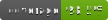
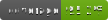

# NW.NGramTextClassification

| NW.NGramTextClassification | NW.NGramTextClassification.CLI |
|---|---|
|||

Contact: numbworks@gmail.com

## Introduction

From the documentation:

> `NW.NGramTextClassification` is a library to perform text classification tasks on the text snippets you provide.

> `NW.NGramTextClassification.CLI` is a command-line application built on the top of `NW.NGramTextClassification`.

## Getting started

- [Documentation (NW.NGramTextClassification)](docs/docs-nw.ngramtextclassification.md)
- [Documentation (NW.NGramTextClassification.CLI)](docs/docs-nw.ngramtextclassification.cli.md)

## Other Links

- [LICENSE](LICENSE)