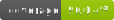

# NW.NGramTextClassification

| <sub>Library</sub> | <sub>Client</sub> |
|---|---|
|||

Contact: numbworks@gmail.com

## Revision History

| Date | Author | Description |
|---|---|---|
| 2020-12-27 | numbworks | Created. |
| 2021-02-15 | numbworks | Updated paragraphs with the correct content. |
| 2021-09-24 | numbworks | Version numbers removed. |
| 2022-09-27 | numbworks | Updated to v3.0.0. |

## In Short

From the documentation:

> `NW.NGramTextClassification` is a .NET Standard library to perform text classification tasks on the text snippets you provide.

> `NW.NGramTextClassificationClient` (`ngramtc`) is a command-line application based on the `NW.NGramTextClassification` library.

## Download the source code

I assume you are on `Windows`, but the library should compile without issues on `Linux` as well. Please:

1. Install [Git for Windows](https://git-scm.com/download/win);
2. Open `Windows Powershell` (or `Windows Terminal` or similar) and type:

```powershell
PS C:\> mkdir NW.NGramTextClassification
PS C:\> cd .\NW.NGramTextClassification\
PS C:\NW.NGramTextClassification> git clone https://github.com/numbworks/NW.NGramTextClassification.git
```

3. Open `NW.NGramTextClassification.sln` with `Visual Studio` or other IDE;
4. Done!

## Download the library's binary package

If you are a .NET developer and you want to use the library from within your projects, the binary packages are available on [NuGet](https://www.nuget.org/packages/NW.NGramTextClassification/).

## Download the client's binary package

If you are an non-developer user, you can download the client from the [Releases](https://github.com/numbworks/NW.NGramTextClassification/releases) page on Github.

## Getting Started

- [Documentation: Library](docs/Documentation-NW.NGramTextClassification.md)
- [Documentation: Client](docs/Documentation-NW.NGramTextClassificationClient.md)

## Other Links

- [LICENSE](LICENSE)