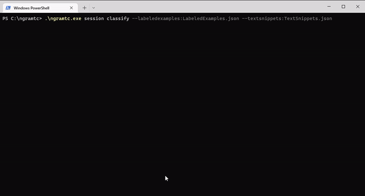

# NW.NGramTextClassificationClient
Contact: numbworks@gmail.com

## Revision History

| Date | Author | Description |
|---|---|---|
| 2021-10-13 | numbworks | Created. |
| 2022-09-27 | numbworks | Updated to v3.0.0. |
| 2022-10-29 | numbworks | Updated to v3.5.0. |
| 2022-11-04 | numbworks | Updated to v3.6.0. |

## Introduction


`NW.NGramTextClassificationClient` (`ngramtc`) is a command-line application to perform text classification tasks based on the `NW.NGramTextClassification` library.

## Overview

The command-line interface for `NW.NGramTextClassificationClient` is summarized by the following table:

|Command|Sub Command|Options|Exit Codes|
|---|---|---|---|
|about|||Success|
|session|||Success|
|session|classify|--labeledexamples:{filename}<br />--textsnippets:{filename}<br />*--folderpath:{path}*<br />*--tokenizerruleset:{filename}*<br />*--minaccuracysingle:{number}*<br />*--minaccuracymultiple:{number}*<br />*--savesession*<br />*--cleanlabeledexamples*<br />*--disableindexserialization*|Success<br />Failure|

The regular font indicates the mandatory options, while the *italic*  font indicates an optional ones.

The exit codes are summarized below:

|Label|Value|
|---|---|
|Success|0|
|Failure|1|

## Getting started

In this document I'll use `Windows` as reference OS, but the procedures are exactly the same on both `Linux` and `Mac`.

To get started:

1. download the application from the [Releases](https://github.com/numbworks/NW.NGramTextClassification/releases) page on Github and unzip it;
2. open a command prompt, such as Windows Terminal;
3. navigate to the application folder;
4. familiarize with each `Command`, `Sub Command` and `Option` provided by the application, such as:

```powershell
PS C:\widjobs>.\ngramtc.exe
PS C:\widjobs>.\ngramtc.exe session
PS C:\widjobs>.\ngramtc.exe session classify --help
PS C:\widjobs>.\ngramtc.exe about
```

## Commands: session classify



The simplest command you can run is `session classify`, which performs a text classification task on the data you provide. At very least, the command will look like:

```powershell
PS C:\ngramtc>.\ngramtc.exe session classify --labeledexamples:LabeledExamples.json --textsnippets:TextSnippets.json
```

The command above requires that you have the two required files (`LabeledExamples.json` and `TextSnippets.json`) located in the same folder as the application, which by default it's the working folder for all the application's activities. 

The command above will log something like this to the console:

```
...
[2022-10-29 22:11:47:640] Attempting to load a collection of 'LabeledExample' objects from: C:\ngramtc\LabeledExamples.json.
[2022-10-29 22:11:47:747] A collection of 'LabeledExample' objects has been successfully loaded.
[2022-10-29 22:11:47:748] Attempting to load a collection of 'TextSnippet' objects from: C:\ngramtc\TextSnippets.json.
[2022-10-29 22:11:47:749] A collection of 'TextSnippet' objects has been successfully loaded.
[2022-10-29 22:11:47:750] The provided snippets are: '2'.
[2022-10-29 22:11:47:767] The provided snippet has been tokenized into '65' INGram object.
[2022-10-29 22:11:47:769] The provided LabeledExample objects have been thru the tokenization process.
...
[2022-10-29 22:11:47:792] The 'SimilarityIndexAverage' object with the highest value is: '[ Label: 'sv', Value: '1' ]'.
[2022-10-29 22:11:47:792] The result of the classification task is: 'sv'.
[2022-10-29 22:11:47:792] The classification task has been successful.
```

If you wish to store the files elsewhere, you can specify a new working folder by using the `folderpath` option - i.e. `--folderpath:C:\Documents`

## Markdown Toolset

Suggested toolset to view and edit this Markdown file:

- [Visual Studio Code](https://code.visualstudio.com/)
- [Markdown Preview Enhanced](https://marketplace.visualstudio.com/items?itemName=shd101wyy.markdown-preview-enhanced)
- [Markdown PDF](https://marketplace.visualstudio.com/items?itemName=yzane.markdown-pdf)